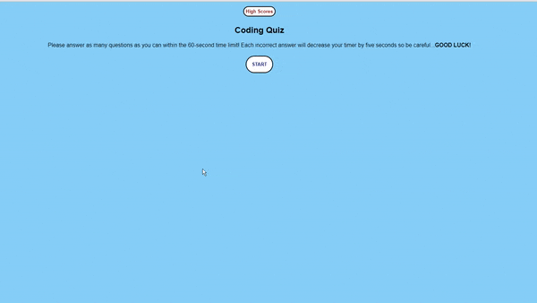

# Week04-Challenge

## Description:

The purpose of this exercise is to build a timed coding quiz with multiple-choice questions. The application will run in the browser and will feature dynamically updated HTML and CSS powered by JavaScript code. Each incorrect answer will result in a 5-second penalty for the player. Once all 5 questions have been answered or the timer reaches 0, the game will end and the player will be able to save their score and initials. The most recent high score can then be shown by clicking on the "View high scores" button.

### Screenshot:

### Links:

https://xvrteo.github.io/Code-Quiz/

https://github.com/XvrTeo/Code-Quiz
